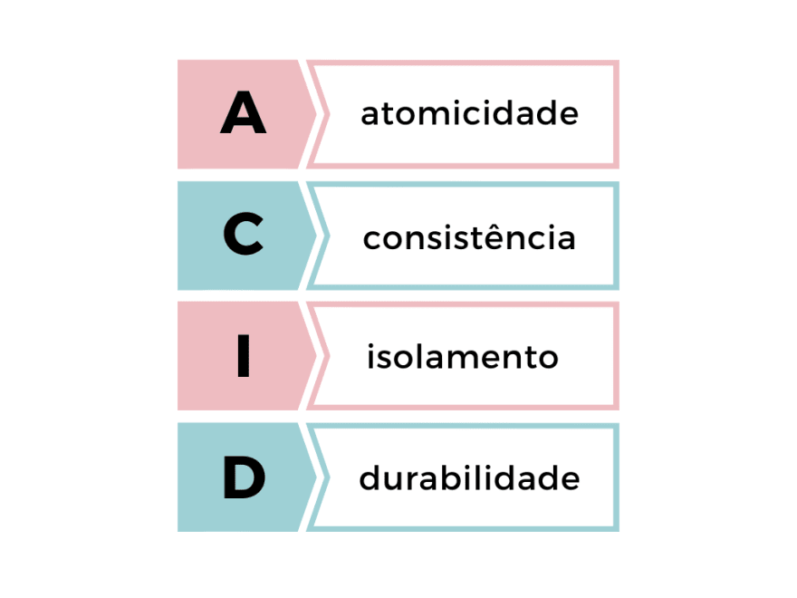

# Programação com Banco de dados

## Introdução

O propósito deste texto é servir como um utilitário focado especificadamente para os estudos da disciplina de programação com banco de dados (TSI - 3° Período).

Portanto dessa forma subentende-se que aquele que lê esse documento já possui uma básica noção sobre SQL, que é a linguagens de consulta a banco de dados relacionais.

---

## Conteúdos abordados neste documento

1. Functions
2. Stored Procedures
3. Triggers
4. Views
5. Cursores
6. Isolamento de Transações
7. Backup e Restauração

---

## Functions (Funções)

Uma function serve como uma forma de realizar o aproveitamento de código, de forma semelhante a programação estruturada.

Ou seja ao invés de repetir um trecho de código repetidas vezes, podemos apenas chamar a função que foi implementada anteriormente.

No Postgres podemos escrever as funções de duas formas, utilizando **SQL** ou a linguagem procedural **PLPGSQL**.

---

**Sintaxe SQL:**

```sql
CREATE FUNCTION nome_function(parametro tipo_parametro)
RETURNS tipo_retorno
AS $$
    SELECT campo FROM tabela
    WHERE...
$$ LANGUAGE SQL;
```

Com a linguagem SQL, declaramos a função e utilizamos os comandos SQL comuns dentro dela, podemos realizar operações de CRUD cujo resultado é retornado pela função quando esta é chamada.

---

**Sintaxe PLPGSQL:**

```sql
CREATE FUNCTION nome_function(parametro tipo_parametro)
RETURNS tipo_retorno
AS $$
DECLARE variavel tipo_variavel
BEGIN
    SELECT valor 
    INTO variavel
    FROM tabela...

    RETURN variavel
END
$$ LANGUAGE PLPGSQL;
```

Já com PLPGSQL, a estrutura da função é semelhante mas se difere pois dentro dela podemos utilizar uma linguagem procedural, semelhante a qualquer outra linguagem de progrmação como Java, Python, etc...

Ou seja por meio do PLPGSQL podemos declarar váriaveis, armazenar valores nelas e retorna-las na função.

---

## Sugestões

Ao utilizar funções utilize a seguinte notação:

```sql
CREATE OR REPLACE FUNCTION
```

Dessa forma, sempre que você alterar a função não será necessário remover e criá-la novamente pois o proprio postgres atualiza o código da sua função.

E para utilizar as funções você pode chamá-las com:

```sql
SELECT function(parametro);
```

Para mais exemplos do uso de functions consulte este [repositório](https://github.com/Guilherme-07062002/ProgBancoDeDadosLista1.git)

---

## Stored Procedures

O diferencial do stored procedures para uma function comum é que o procedure não possui retorno. Além disso um procedure deve ser escrito utilizando PLPGSQL.

Sintaxe

```sql
CREATE PROCEDURE nome_procedure(parametro tipo_parametro)
AS $$
BEGIN
    -- Código
END;
$$ LANGUAGE PLPGSQL;
```

E para utilizar stored procedures você pode chamá-las com:

```sql
CALL procedure(parametro);
```

---

## Triggers

A trigger é uma função que será executada quando um determinado evento ocorrer.

Sua estrutura é muito semelhante a criação de um function comum, a diferença é que a função retorna `trigger`.

Então antes de tudo deve-se criar a função que será executada quando o trigger for acionado.

```sql
CREATE OR REPLACE FUNCTION nome_function( parametro tipo_parametro)
RETURNS trigger AS $$
BEGIN
    -- Código
END;
$$ LANGUAGE PLPGSQL;
```

Em triggers existem os objetos:

* `OLD` - Por meio dele podemos acessar as propriedades do registro antigo (no caso de um update ou delete, ele armazena o registro antes da modificação).
* `NEW` - Em contrapartida ao OLD, o **NEW** permite acessar o novo campo que está sendo inserido.

Ou seja, ao inserirmos um dado na tabela podemos realizar alguma operação com o registro anterior por meio do OLD, ou manipular de alguma forma a nova informação recém armazenada por meio do NEW.

Além disso podemos especificar em que momento a função será executada no trigger.

* `BEFORE` - A função será executada antes do evento.
* `AFTER` - A função será executada após o evento.
* `INSTEAD_OF` - Permite utilizar funções para manipulação de dados em Views.

Por fim, após criada a função você deve "instanciá-la", criando o gatilho que será executado, nele você especifica a função que será chamada e a condição que irá dispará-lo.

Ou seja, no exemplo abaixo a função será executada após cada inserção que for realizada em *tabela*:

```sql
CREATE TRIGGER nome_function AFTER INSERT ON tabela
FOR EACH ROW EXECUTE PROCEDURE nome_function();
```

Você pode especificar qual o evento que irá disparar a trigger, pode ser um INSERT, UPDATE ou DELETE por exemplo.

---

## Views

Uma view no postgres seria algo como pegar uma parte isolada de uma tabela e apartir dela criar um conjunto menor, um fragmento ou uma "subtabela".

Sintaxe

```sql
CREATE VIEW nome_view AS SELECT campo1, campo2 FROM Tabela;
```

No exemplo acima criamos uma view com o conteúdo do campo1 e campo2 provenientes de um select em Tabela.

Uma View é um objeto que permite a visualização de dados da tabela a qual esteja associada. É criada com base em consultas nas tabelas para selecionar colunas.

Sendo assim, podemos por exemplo realizar uma consulta com base view criada anteriormente.

```sql
SELECT campo1 FROM nome_view;
```

Para excluir uma view usamos o seguinte comando:

```sql
DROP VIEW nome_view;
```

---

## Cursores

Cursores são utilizados para processar uma tupla de cada vez dentro do programa.
Um cursor pode ser representado através da metáfora de um ponteiro que aponta
para uma única tupla do resultado de uma consulta que retornou diversas tuplas.

Um Cursor permite encapsular uma query e processar uma tupla por vez. Usa-se
cursor para dividir um grande result set em partes e processá-las individualmente, evitando
overflow de memória.

### Declaração de cursores

Há dois tipos de cursores:

* Unbound:
Todo acesso se dá por meio de uma variável de cursor.

    O PostgreSQL provê um tipo especial - REFCURSOR.
    Nesse caso a variável pode ser utilizada com qualquer query.

    ```sql
    DECLARE
    meu_cursor REFCURSOR;
    ```

    ---
* Bound:
A declaração é ligada diretamente uma query.

    Para ter acesso ao cursor é necessário declarar uma variável, mas nesse caso a variável
    está ligada (bound) a uma query especificada.

    ```sql
    DECLARE
    cur_filme CURSOR FOR SELECT * FROM filme;
    ```

### Exemplo do uso de cursor

```sql
CREATE OR REPLACE FUNCTION refAlunos()
RETURNS void AS $$
DECLARE
    exemplo_cursor_alunos CURSOR FOR SELECT * from ALUNOS;
    aluno alunos%ROWTYPE;
BEGIN
    OPEN exemplo_cursor_alunos;

    FETCH FIRST FROM exemplo_cursor_alunos into aluno;
    RAISE NOTICE 'Nome: %', aluno.nom_alu;

    FETCH exemplo_cursor_alunos into aluno;
    RAISE NOTICE 'Nome: %', aluno.nom_alu;

    FETCH LAST FROM exemplo_cursor_alunos into aluno;
    RAISE NOTICE 'Nome: %', aluno.nom_alu;

    CLOSE exemplo_cursor_alunos;
END;
$$LANGUAGE plpgsql;

SELECT refAlunos();
```

### Iterando resultado com `for`

```sql
CREATE OR REPLACE FUNCTION refAlunos2()
RETURNS void AS $$
DECLARE
    exemplo_cursor_alunos CURSOR FOR SELECT * from ALUNOS;
BEGIN
    FOR aluno IN exemplo_cursor_alunos LOOP
    RAISE NOTICE 'Nome: %', aluno.nom_alu;
    END LOOP;
END;
$$LANGUAGE plpgsql;

SELECT refAlunos2();
```

---

## Transaction Isolation (Isolamento de Transações)

Imagine o cenário de uma aplicação com um grande número de usuários. É esperado que, em determinado momento haja um número considerável de requisições ao servidor que sustenta esse sistema.

Com isso, é necessário que o SGBD responsável pela base de dados, saiba como lidar a essa grande quantidade de `transações`.

*Uma transação nada mais é do que o processo de transacionar, ou seja efetuar uma comunicação entre duas partes, aonde ocorre uma `troca` de dados/informações.*

Também pode ser ententido como um conjunto de operações(queries) tratadas como apenas uma.

Ex: você precisa fazer um INSERT em uma conta bancária e depois um UPDATE. Essas 2 operações só ficarão permanentes no banco de dados se ambos forem executadas com sucesso.

Dessa forma, surge o seguinte questionamento:

O que acontece se o usuário João alterar os dados de um banco ao mesmo tempo que José realiza uma consulta com o intuito de retornar esses dados?

* Vai dar erro?
* José vai pegar os dados já alterados? Ou a consulta vai retornar os dados antes da atualização?
* João vai conseguir de fato alterar os dados?

E graças a esses questionamentos, surge o conceito de `Isolamento de Transação`.

Ou seja, essa troca deve ocorrer de forma isolada, seguindo diferentes comportamentos de acordo com o contexto em que a transação acontece, para que não ocorram problemas de inconsistência nesses dados.

### Principios ACID



Em uma transação de um banco de dados é recomendável que ela obedeça aos principios estabelecidos pela sigla ACID.

Dessa forma falando sobre cada letra:

* Atomicidade - A transação uma vez que é iniciada, deve ir até o fim ou então é cancelada;
* Consistência - Apenas dados válidos são salvos;
* Isolamento - Uma transação não sofre interferência de outra transação concorrente;
* Durabilidade - O que é salvo não será perdido;

Portanto com base nesses quatro princípios é estabelecido um contrato que todas as transações devem obedecer.

No caso de agora estamos discutindo sobre a letra I do ACID, o `Isolamento`, e como o Sistema de Gerenciamento do Banco de Dados consegue isolar cada transação concorrente, de forma que não ocorram colisões.

### Níveis de Isolamento

[Para mais detalhes, leia esse artigo](https://www.tabnews.com.br/allangrds/diario-fullstack-3-iniciando-meus-estudos-em-banco-de-dados-e-entendendo-acid)

Por padrão o SQL define quatro níveis de isolamento, o mais restrito e seguro entre eles é o serializable, e os outros são alternativas de se lidar com fenômenos que ocorrem devido a transações concorrentes no banco de dados.

Esses fenômenos são:

* Dirty read (Leitura suja) - A transação lê dados de outra concorrente, que ainda não foi commitada;
* Nonrepeatable read (Leitura não repetível) - A transação relê os dados que já foram lidos e observa qual deles foram alterados por outra transação;
* Phantom read (Leitura fantasma) - A transação retorna um conjunto de dados que já foi alterado ou deletado, ou seja dados fantasmas, que não existem mais.
* Serialization anomaly (Anomalia de serialização) - Este fênomeno acontece quando um grupo de transações concorrentes e comitadas simultaneamente tem seus resultados sobrepostos uma a outra.

### Níveis de isolamento

Os níveis de isolamento da transação são a medida da qual o isolamento da transação é executado com sucesso. Cada nível de isolamento é definido pela presença de nenhum, um ou mais fenômenos, sendo eles:

* Leitura não comitada - Sem isolamento. Qualquer mudança, comitada ou não, poderá ser vista na transação.

* Leitura comitada - As queries de uma transação só enxergam o que foi comitado por outras transações.

* Leitura repetida - A transação garantirá que enquanto uma query estiver lendo uma linha, ela permanecerá igual enquanto estiver sendo executada.

* Serializável - Esse o nível mais bruto. As transações serão executadas uma após a outra, ao invés de concorrentes.

## Backup e Restauração

### SQL DUMP

A idéia por trás do `DUMP` é gerar um arquivo SQL com os comandos necessários para gerar a estrutura de um determinado screenshot de um banco de dados.

O uso básico desse comando é:

```shell
pg_dump nome_db>arquivo_dump
```

Além de SQL, um dump pode gerar um arquivo com diferentes formatos, que seu uso varia dependendo do contexto.

Dessa forma, ao se realizar um backup de um banco de dados, o que é feito por baixo dos panos nada mais é do que gerar um arquivo com todas as instruções necessárias para que um SGBD consiga recriar, a estrutura de um banco com todos os dados do momento em que foi feito o backup.

A importância do backup é de fato criar um cópia do banco de dados, ou seja, em caso de alguma falha na base original, é so restaurar o backup e os dados serão restaurados.

Mas tem um porém, os dados só serão restaurados até o ponto em que o backup foi feito, se mais alguma informação foi adicionada depois disso, é bem provável que ela será perdida.

Graças a isso, dependendo das politicas de administração da empresa ou equipe que rege determinado banco de dados, o backup é realizado regularmente, com o intuito de amenizar a possivel perda de dados em caso de falha.
